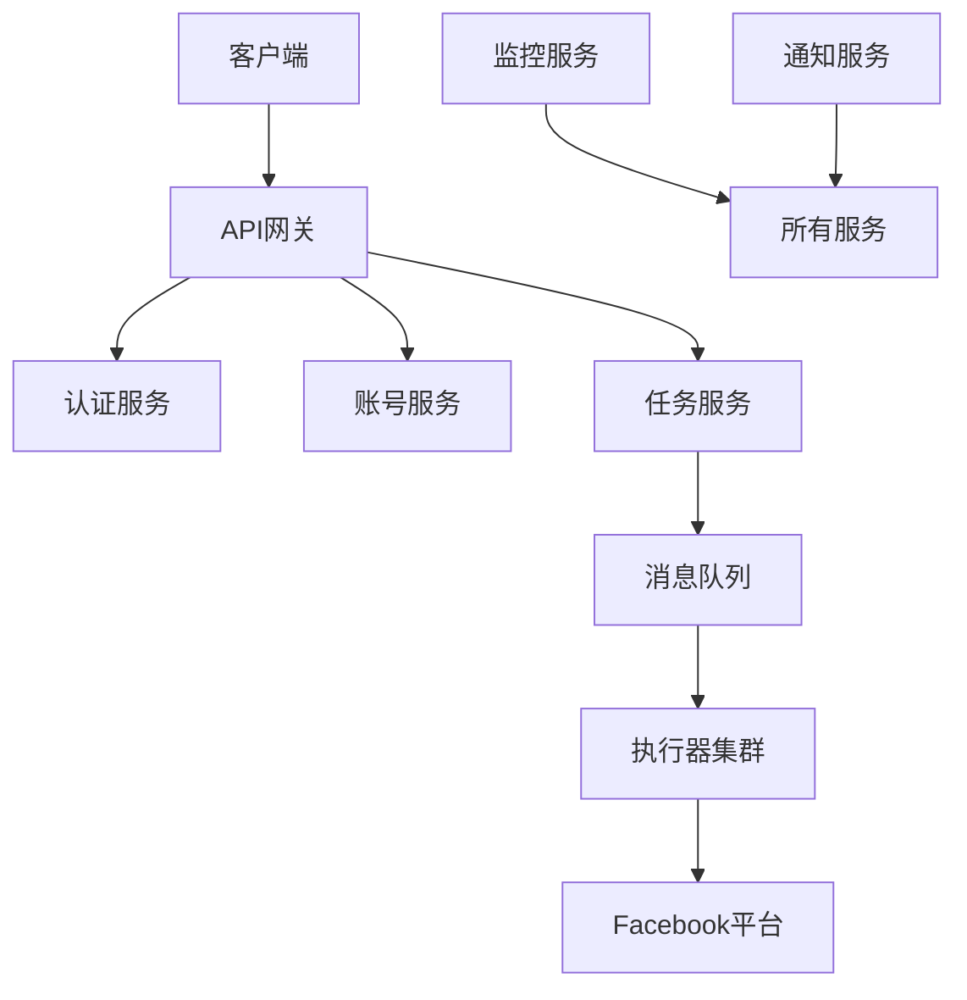

# Facebook Auto Bot - 高级用户培训文档

## 专家级配置和优化

本指南面向技术专家和系统管理员，深入讲解 Facebook Auto Bot 的高级配置、性能优化、安全加固和系统集成。

## 目录
1. [系统架构深度解析](#系统架构深度解析)
2. [性能优化高级技巧](#性能优化高级技巧)
3. [安全加固和合规配置](#安全加固和合规配置)
4. [高可用性和灾备方案](#高可用性和灾备方案)
5. [系统集成和扩展开发](#系统集成和扩展开发)
6. [监控和运维自动化](#监控和运维自动化)
7. [故障诊断和性能调优](#故障诊断和性能调优)

---

## 系统架构深度解析

### 1.1 微服务架构设计

#### 1.1.1 服务拆分
Facebook Auto Bot 采用微服务架构，主要服务包括：

```yaml
services:
  api-gateway:
    description: "API网关，统一入口"
    port: 3000
    dependencies: [auth, accounts, tasks]
    
  auth-service:
    description: "认证和授权服务"
    port: 3001
    database: "auth_db"
    
  account-service:
    description: "账号管理服务"
    port: 3002
    database: "accounts_db"
    cache: "redis:accounts"
    
  task-service:
    description: "任务调度服务"
    port: 3003
    database: "tasks_db"
    message_queue: "rabbitmq:tasks"
    
  execution-service:
    description: "任务执行服务"
    port: 3004
    scaling: "horizontal"
    max_instances: 10
    
  monitoring-service:
    description: "监控和告警服务"
    port: 3005
    database: "monitoring_db"
    metrics: "prometheus"
    
  notification-service:
    description: "通知服务"
    port: 3006
    integrations: [email, sms, webhook, slack]
```

#### 1.1.2 服务通信


#### 1.1.3 数据流设计
```yaml
data_flow:
  task_execution:
    - step: "任务创建"
      service: "task-service"
      data: "任务配置"
      
    - step: "任务调度"
      service: "task-service"
      action: "放入队列"
      
    - step: "任务执行"
      service: "execution-service"
      data: "账号凭证、任务参数"
      
    - step: "结果处理"
      service: "task-service"
      action: "更新状态、记录日志"
      
    - step: "监控告警"
      service: "monitoring-service"
      action: "检查指标、触发告警"
      
    - step: "通知发送"
      service: "notification-service"
      action: "发送结果通知"
```

### 1.2 数据库架构优化

#### 1.2.1 分库分表策略
```sql
-- 账号数据分表策略
CREATE TABLE facebook_accounts_0 (
    id UUID PRIMARY KEY,
    user_id UUID,
    email VARCHAR(255),
    -- 其他字段...
    shard_key INT GENERATED ALWAYS AS (hash_code(email) % 16)
) PARTITION BY HASH(shard_key);

-- 创建16个分区
CREATE TABLE facebook_accounts_1 PARTITION OF facebook_accounts_0
    FOR VALUES WITH (MODULUS 16, REMAINDER 1);
-- ... 创建其他分区
```

#### 1.2.2 读写分离配置
```yaml
database:
  primary:
    host: "db-primary.example.com"
    port: 5432
    role: "master"
    connections:
      max: 50
      min: 10
      
  replicas:
    - host: "db-replica-1.example.com"
      port: 5432
      role: "read_only"
      weight: 60
      
    - host: "db-replica-2.example.com"
      port: 5432
      role: "read_only"
      weight: 40
  
  routing:
    read_write_splitting: true
    auto_detect_master: true
    load_balancing: "weighted_round_robin"
```

#### 1.2.3 缓存策略设计
```yaml
cache_strategy:
  redis:
    primary: "redis://redis-primary:6379"
    replicas:
      - "redis://redis-replica-1:6379"
      - "redis://redis-replica-2:6379"
    
    cache_policies:
      account_data:
        ttl: "1小时"
        strategy: "write_through"
        invalidation: "on_update"
        
      task_results:
        ttl: "24小时"
        strategy: "write_back"
        compression: "gzip"
        
      session_data:
        ttl: "7天"
        strategy: "lazy_write"
        encryption: true
  
  local_cache:
    enabled: true
    max_size: "100MB"
    eviction_policy: "LRU"
    ttl: "5分钟"
```

### 1.3 消息队列架构

#### 1.3.1 队列拓扑设计
```yaml
message_queues:
  task_queue:
    type: "rabbitmq"
    exchange: "tasks"
    routing_keys:
      - "task.create"
      - "task.update"
      - "task.delete"
      - "task.execute"
    
    queues:
      high_priority:
        prefetch_count: 1
        durable: true
        dead_letter_exchange: "tasks.dlx"
        
      normal_priority:
        prefetch_count: 10
        durable: true
        
      low_priority:
        prefetch_count: 50
        durable: false
  
  event_queue:
    type: "kafka"
    topics:
      - "account.events"
      - "task.events"
      - "system.events"
    
    partitions: 3
    replication_factor: 2
    retention_hours: 168
```

#### 1.3.2 消息处理模式
```python
class TaskMessageProcessor:
    """任务消息处理器"""
    
    def __init__(self):
        self.connection = connect_to_rabbitmq()
        self.channel = self.connection.channel()
        
        # 声明交换机和队列
        self.setup_queues()
        
    def setup_queues(self):
        """设置队列拓扑"""
        # 主交换机
        self.channel.exchange_declare(
            exchange='tasks',
            exchange_type='topic',
            durable=True
        )
        
        # 死信交换机
        self.channel.exchange_declare(
            exchange='tasks.dlx',
            exchange_type='fanout',
            durable=True
        )
        
        # 高优先级队列
        self.channel.queue_declare(
            queue='tasks.high',
            durable=True,
            arguments={
                'x-max-priority': 10,
                'x-dead-letter-exchange': 'tasks.dlx'
            }
        )
        
        # 绑定队列
        self.channel.queue_bind(
            exchange='tasks',
            queue='tasks.high',
            routing_key='task.execute.high'
        )
    
    def process_message(self, method, properties, body):
        """处理消息"""
        try:
            task_data = json.loads(body)
            
            # 根据优先级处理
            if properties.priority >= 8:
                self.process_high_priority(task_data)
            else:
                self.process_normal_priority(task_data)
                
            # 确认消息
            self.channel.basic_ack(delivery_tag=method.delivery_tag)
            
        except Exception as e:
            # 处理失败，重试或放入死信队列
            self.handle_failure(method, properties, body, e)
```

---

## 性能优化高级技巧

### 2.1 数据库性能优化

#### 2.1.1 查询优化策略
```sql
-- 1. 索引优化
CREATE INDEX idx_accounts_user_status 
ON facebook_accounts(user_id, status, last_active_at DESC);

CREATE INDEX idx_tasks_schedule_status 
ON scheduled_tasks(
    execute_at, 
    status, 
    priority DESC
) INCLUDE (task_data, account_id);

-- 2. 分区表维护
CREATE TABLE task_logs_2024_04 PARTITION OF task_logs
FOR VALUES FROM ('2024-04-01') TO ('2024-05-01');

-- 3. 物化视图
CREATE MATERIALIZED VIEW mv_daily_stats AS
SELECT 
    DATE(created_at) as date,
    COUNT(*) as total_tasks,
    SUM(CASE WHEN status = 'success' THEN 1 ELSE 0 END) as success_tasks,
    AVG(execution_time) as avg_execution_time
FROM task_executions
WHERE created_at >= CURRENT_DATE - INTERVAL '30 days'
GROUP BY DATE(created_at)
WITH DATA;

-- 刷新物化视图
REFRESH MATERIALIZED VIEW CONCURRENTLY mv_daily_stats;
```

#### 2.1.2 连接池优化
```yaml
database_pool:
  postgresql:
    max_connections: 100
    min_connections: 10
    connection_timeout: 30
    idle_timeout: 600
    max_lifetime: 3600
    
    pool_config:
      test_on_borrow: true
      test_on_return: false
      test_while_idle: true
      validation_query: "SELECT 1"
      
    monitoring:
      enable: true
      metrics:
        - "active_connections"
        - "idle_connections"
        - "waiting_connections"
        - "connection_creation_time"
        
    tuning:
      statement_cache_size: 100
      prepare_threshold: 5
      binary_transfer: true
```

### 2.2 应用层性能优化

#### 2.2.1 异步处理优化
```javascript
// 使用异步队列处理耗时操作
class AsyncTaskProcessor {
  constructor() {
    this.queue = new Bull('task-processing', {
      redis: {
        host: 'redis.example.com',
        port: 6379
      },
      defaultJobOptions: {
        attempts: 3,
        backoff: {
          type: 'exponential',
          delay: 1000
        },
        removeOnComplete: true,
        removeOnFail: false
      }
    });
    
    // 设置处理器
    this.setupProcessors();
  }
  
  setupProcessors() {
    // 并发处理配置
    this.queue.process('image-processing', 5, async (job) => {
      return await this.processImage(job.data);
    });
    
    this.queue.process('content-analysis', 10, async (job) => {
      return await this.analyzeContent(job.data);
    });
    
    this.queue.process('data-export', 2, async (job) => {
      return await this.exportData(job.data);
    });
  }
  
  async addTask(type, data, options = {}) {
    return await this.queue.add(type, data, {
      priority: options.priority || 1,
      delay: options.delay || 0,
      lifo: options.lifo || false
    });
  }
}
```

#### 2.2.2 内存管理优化
```typescript
// 内存缓存管理器
class MemoryCacheManager {
  private caches: Map<string, LRUCache<string, any>>;
  private metrics: CacheMetrics;
  
  constructor() {
    this.caches = new Map();
    this.metrics = new CacheMetrics();
    
    // 初始化各类型缓存
    this.initCache('account', {
      max: 1000,
      ttl: 5 * 60 * 1000, // 5分钟
      updateAgeOnGet: true
    });
    
    this.initCache('task', {
      max: 5000,
      ttl: 10 * 60 * 1000, // 10分钟
      updateAgeOnGet: false
    });
    
    // 监控内存使用
    this.startMonitoring();
  }
  
  private initCache(name: string, options: LRU.Options<string, any>) {
    const cache = new LRUCache(options);
    this.caches.set(name, cache);
    
    // 设置缓存统计
    this.metrics.registerCache(name);
  }
  
  private startMonitoring() {
    // 定期检查内存使用
    setInterval(() => {
      for (const [name, cache] of this.caches) {
        const stats = {
          size: cache.size,
          hits: cache.hits,
          misses: cache.misses,
          ratio: cache.hits / (cache.hits + cache.misses)
        };
        
        this.metrics.update(name, stats);
        
        // 如果命中率低，调整策略
        if (stats.ratio < 0.3) {
          this.adjustCacheStrategy(name);
        }
      }
    }, 60000); // 每分钟检查一次
  }
  
  private adjustCacheStrategy(name: string) {
    const cache = this.caches.get(name);
    if (!cache) return;
    
    // 根据使用模式调整TTL
    const avgTTL = this.metrics.getAverageTTL(name);
    if (avgTTL < cache.ttl * 0.5) {
      // 数据访问频繁，延长TTL
      cache.ttl = Math.min(cache.ttl * 1.5, 3600000); // 最多1小时
    } else {
      // 数据访问不频繁，缩短TTL
      cache.ttl = Math.max(cache.ttl * 0.8, 60000); // 最少1分钟
    }
  }
}
```

### 2.3 网络性能优化

#### 2.3.1 HTTP连接优化
```yaml
http_client:
  axios:
    base_config:
      timeout: 30000
      maxRedirects: 5
      maxContentLength: 50 * 1024 * 1024  # 50MB
      
    connection_pool:
      maxSockets: 100
      maxFreeSockets: 10
      timeout: 30000
      
    retry_config:
      retries: 3
      retryDelay: (retryCount) => {
        return 1000 * Math.pow(2, retryCount);
      }
      retryCondition: (error) => {
        return axios.isRetryableError(error) || 
               error.response?.status >= 500;
      }
      
    cache_config:
      enabled: true
      ttl: 300000  # 5分钟
      exclude: ["POST", "PUT", "DELETE", "PATCH"]
      keyGenerator: (config) => {
        return `${config.method}:${config.url}:${JSON.stringify(config.params)}`;
      }
```

#### 2.3.2 WebSocket连接管理
```javascript
class WebSocketManager {
  constructor() {
    this.connections = new Map();
    this.reconnectAttempts = new Map();
    this.maxReconnectAttempts = 5;
    
    // 心跳检测
    this.heartbeatInterval = setInterval(() => {
      this.checkConnections();
    }, 30000);
  }
  
  async connect(url, options = {}) {
    const connectionId = generateId();
    
    const ws = new WebSocket(url, {
      perMessageDeflate: true,
      maxPayload: 100 * 1024 * 1024, // 100MB
      ...options
    });
    
    // 设置事件处理器
    ws.on('open', () => this.onOpen(connectionId, ws));
    ws.on('message', (data) => this.onMessage(connectionId, data));
    ws.on('error', (error) => this.onError(connectionId, error));
    ws.on('close', () => this.onClose(connectionId));
    
    // 设置超时
    const timeout = setTimeout(() => {
      if (ws.readyState !== WebSocket.OPEN) {
        ws.terminate();
        this.reconnect(url, connectionId, options);
      }
    }, 10000);
    
    ws.on('open', () => clearTimeout(timeout));
    
    this.connections.set(connectionId, {
      ws,
      url,
      options,
      lastActivity: Date.now(),
      connected: false
    });
    
    return connectionId;
  }
  
  async reconnect(url, connectionId, options) {
    const attempts = this.reconnectAttempts.get(connectionId) || 0;
    
    if (attempts >= this.maxReconnectAttempts) {
      console.error(`Max reconnect attempts reached for ${connectionId}`);
      this.connections.delete(connectionId);
      return;
    }
    
    // 指数退避重连
    const delay = Math.min(1000 * Math.pow(2, attempts), 30000);
    
    setTimeout(async () => {
      console.log(`Reconnecting ${connectionId}, attempt ${attempts + 1}`);
      await this.connect(url, options);
      this.reconnectAttempts.set(connectionId, attempts + 1);
    }, delay);
  }
}
```

---

## 安全加固和合规配置

### 3.1 安全架构设计

#### 3.1.1 防御层设计
```yaml
security_layers:
  network_layer:
    firewall:
      enabled: true
      rules:
        - action: "allow"
          source: "10.0.0.0/8"
          port: 3000
          
        - action: "deny"
          source: "0.0.0.0/0"
          port: 22
          
    waf:
      enabled: true
      ruleset: "owasp_crs"
      blocking_mode: true
    
  application_layer:
    authentication:
      method: "jwt"
      token_ttl: "1小时"
      refresh_token_ttl