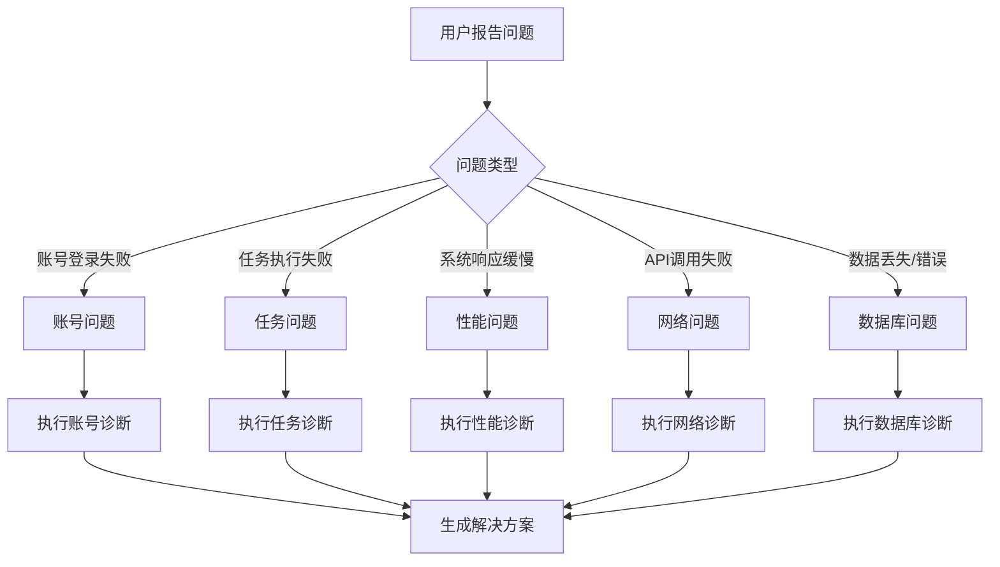

# Facebook Auto Bot - 故障排除指南

## 文档版本
- **版本**: 1.0.0
- **更新日期**: 2026-04-13
- **适用系统版本**: Facebook Auto Bot v1.0

---

## 目录
1. [快速诊断流程](#快速诊断流程)
2. [常见问题分类](#常见问题分类)
3. [账号相关问题](#账号相关问题)
4. [任务执行问题](#任务执行问题)
5. [系统性能问题](#系统性能问题)
6. [网络连接问题](#网络连接问题)
7. [数据库问题](#数据库问题)
8. [第三方服务问题](#第三方服务问题)
9. [错误代码详解](#错误代码详解)
10. [紧急恢复步骤](#紧急恢复步骤)

---

## 快速诊断流程

### 1. 问题识别


### 2. 诊断工具
```bash
# 系统状态检查脚本
#!/bin/bash
echo "=== Facebook Auto Bot 系统诊断 ==="
echo "诊断时间: $(date)"
echo ""

# 1. 检查服务状态
echo "1. 服务状态检查:"
systemctl status fbautobot-backend --no-pager
systemctl status fbautobot-frontend --no-pager
systemctl status postgresql --no-pager
systemctl status redis --no-pager
echo ""

# 2. 检查网络连接
echo "2. 网络连接检查:"
ping -c 3 api.fbautobot.com
curl -I https://api.fbautobot.com/health
echo ""

# 3. 检查资源使用
echo "3. 资源使用检查:"
free -h
df -h /
top -b -n 1 | head -20
echo ""

# 4. 检查日志错误
echo "4. 最近错误日志:"
tail -50 /var/log/fbautobot/application.log | grep -i error
echo ""

# 5. 检查数据库连接
echo "5. 数据库连接检查:"
psql -U fbautobot -d fbautobot -c "SELECT 1 as connection_test;"
echo ""

echo "=== 诊断完成 ==="
```

### 3. 紧急联系人
| 问题类型 | 紧急联系人 | 联系方式 | 响应时间 |
|----------|------------|----------|----------|
| P1 - 系统完全不可用 | 运维值班 | +86 13800138000 | 15分钟内 |
| P2 - 核心功能故障 | 技术支持 | support@fbautobot.com | 30分钟内 |
| P3 - 部分功能问题 | 客服团队 | help@fbautobot.com | 2小时内 |
| P4 - 一般性问题 | 文档中心 | docs.fbautobot.com | 8小时内 |

---

## 常见问题分类

### 问题严重等级
| 等级 | 描述 | 影响范围 | 响应要求 |
|------|------|----------|----------|
| **严重** | 系统完全不可用 | 所有用户 | 立即响应，24/7 |
| **高** | 核心功能不可用 | 多数用户 | 2小时内响应 |
| **中** | 部分功能受限 | 部分用户 | 8小时内响应 |
| **低** | 轻微问题，不影响使用 | 个别用户 | 24小时内响应 |

### 问题解决时间目标
| 问题类型 | 检测时间 | 诊断时间 | 解决时间 | 总恢复时间 |
|----------|----------|----------|----------|------------|
| 账号登录失败 | < 2分钟 | < 5分钟 | < 10分钟 | < 17分钟 |
| 任务执行失败 | < 5分钟 | < 10分钟 | < 30分钟 | < 45分钟 |
| 系统性能下降 | < 10分钟 | < 15分钟 | < 1小时 | < 1.5小时 |
| 数据不一致 | < 15分钟 | < 30分钟 | < 2小时 | < 3小时 |
| 完全系统故障 | < 2分钟 | < 10分钟 | < 4小时 | < 4.5小时 |

---

## 账号相关问题

### 问题1: Facebook账号登录失败
**症状**:
- 账号状态显示为"错误"或"登录失败"
- 无法执行任何任务
- 收到"认证失败"错误

**可能原因**:
1. Facebook账号密码错误
2. 双重验证未通过
3. Facebook账号被限制或封禁
4. VPN/IP配置问题
5. 网络连接问题

**诊断步骤**:
```bash
# 1. 检查账号状态
curl -X GET "https://api.fbautobot.com/facebook-accounts/{account_id}" \
  -H "Authorization: Bearer {token}"

# 2. 测试账号连接
curl -X POST "https://api.fbautobot.com/facebook-accounts/{account_id}/test-connection" \
  -H "Authorization: Bearer {token}"

# 3. 查看详细错误日志
grep "LOGIN_FAILED" /var/log/fbautobot/application.log | tail -10
```

**解决方案**:

#### 方案A: 密码错误或更改
1. **手动验证**: 尝试在浏览器中登录Facebook确认密码
2. **更新密码**: 在系统中更新Facebook账号密码
3. **重新授权**: 执行重新登录操作

```bash
# 更新账号密码
curl -X PATCH "https://api.fbautobot.com/facebook-accounts/{account_id}" \
  -H "Authorization: Bearer {token}" \
  -H "Content-Type: application/json" \
  -d '{"facebook_password": "new_password"}'

# 强制重新登录
curl -X POST "https://api.fbautobot.com/facebook-accounts/{account_id}/login" \
  -H "Authorization: Bearer {token}" \
  -H "Content-Type: application/json" \
  -d '{"force": true}'
```

#### 方案B: 双重验证问题
1. **检查手机验证码**: 确保可以接收短信验证码
2. **使用备用代码**: 如果有备用验证码
3. **临时禁用双重验证**: 在Facebook安全设置中临时禁用

#### 方案C: 账号被限制
1. **检查账号状态**: 登录Facebook查看是否有警告或限制
2. **提交申诉**: 如果账号被误封，提交申诉
3. **等待解封**: 有些限制会自动解除

#### 方案D: VPN/IP问题
1. **测试VPN连接**: 
```bash
# 测试VPN连通性
ping -c 3 {vpn_server}
curl --interface {vpn_interface} https://facebook.com
```

2. **更换VPN配置**:
```bash
# 更新账号VPN配置
curl -X PATCH "https://api.fbautobot.com/facebook-accounts/{account_id}" \
  -H "Authorization: Bearer {token}" \
  -H "Content-Type: application/json" \
  -d '{"vpn_config_id": "new_vpn_id"}'
```

3. **检查IP黑名单**: 确认当前IP不在Facebook黑名单中

**预防措施**:
- 定期更新Facebook账号密码
- 启用账号健康监控
- 使用多个VPN/IP轮换
- 定期备份账号会话

### 问题2: 账号频繁掉线
**症状**:
- 账号状态在"活跃"和"错误"之间频繁切换
- 任务执行中断
- 会话过期错误

**诊断**:
```bash
# 检查账号健康历史
grep "account_health" /var/log/fbautobot/application.log | grep "{account_id}"

# 检查网络稳定性
ping -c 100 {facebook_server} | grep "packet loss"

# 检查会话有效期
psql -U fbautobot -d fbautobot -c \
  "SELECT session_expires_at FROM facebook_accounts WHERE id = '{account_id}';"
```

**解决方案**:
1. **增加心跳频率**: 调整账号健康检查间隔
2. **优化网络连接**: 使用更稳定的VPN服务
3. **延长会话有效期**: 配置更长的会话保持时间
4. **实现自动重连**: 启用账号自动恢复功能

### 问题3: 账号被Facebook封禁
**紧急处理流程**:
1. **立即停止所有活动**: 停止该账号的所有任务
2. **分析封禁原因**: 检查最近的操作为什么触发封禁
3. **提交申诉**: 准备材料提交Facebook申诉
4. **调整操作策略**: 降低频率，增加人工互动
5. **启用备用账号**: 切换到其他账号继续服务

---

## 任务执行问题

### 问题1: 任务创建失败
**症状**:
- 无法创建新任务
- 任务保存时出现错误
- 任务列表不显示新任务

**诊断**:
```bash
# 检查任务服务状态
systemctl status fbautobot-task-scheduler

# 检查数据库连接
psql -U fbautobot -d fbautobot -c \
  "SELECT COUNT(*) FROM tasks WHERE status = 'failed' AND created_at > NOW() - INTERVAL '1 hour';"

# 查看任务创建日志
tail -100 /var/log/fbautobot/task.log | grep "CREATE_FAILED"
```

**常见原因和解决方案**:

#### 原因A: 数据库连接问题
```bash
# 检查数据库连接池
psql -U fbautobot -d fbautobot -c \
  "SELECT count(*) as active_connections FROM pg_stat_activity WHERE state = 'active';"

# 如果连接数过多，清理空闲连接
psql -U fbautobot -d fbautobot -c \
  "SELECT pg_terminate_backend(pid) FROM pg_stat_activity \
   WHERE state = 'idle' AND now() - state_change > interval '10 minutes';"
```

#### 原因B: 数据验证失败
1. **检查任务数据格式**: 确保所有必填字段都已提供
2. **验证账号状态**: 确保指定的账号处于活跃状态
3. **检查时间格式**: 确保计划时间格式正确

#### 原因C: 权限不足
1. **检查用户权限**: 确认用户有创建任务的权限
2. **检查账号配额**: 确认没有超过任务数量限制
3. **检查时间限制**: 确认没有违反调度时间限制

### 问题2: 任务执行失败
**症状**:
- 任务状态显示为"失败"
- 收到任务执行错误通知
- 任务结果包含错误信息

**诊断流程**:
```bash
#!/bin/bash
# 任务失败诊断脚本
TASK_ID="$1"

echo "=== 诊断任务失败: $TASK_ID ==="

# 1. 获取任务详情
curl -s -X GET "https://api.fbautobot.com/tasks/$TASK_ID" \
  -H "Authorization: Bearer {token}" | jq '.data'

# 2. 检查执行日志
grep "TASK_EXECUTE.*$TASK_ID" /var/log/fbautobot/task.log | tail -20

# 3. 检查相关账号状态
ACCOUNT_ID=$(curl -s -X GET "https://api.fbautobot.com/tasks/$TASK_ID" \
  -H "Authorization: Bearer {token}" | jq -r '.data.account_id')

echo "相关账号: $ACCOUNT_ID"
curl -s -X GET "https://api.fbautobot.com/facebook-accounts/$ACCOUNT_ID" \
  -H "Authorization: Bearer {token}" | jq '.data.status'

# 4. 检查系统资源
top -b -n 1 | grep -E "(node|postgres|redis)"
```

**常见错误和解决方案**:

#### 错误A: 账号未登录
```
错误信息: "Account not logged in"
解决方案:
1. 检查账号登录状态
2. 执行强制重新登录
3. 验证账号凭证
```

#### 错误B: Facebook API限制
```
错误信息: "API rate limit exceeded"
解决方案:
1. 降低任务执行频率
2. 增加任务执行间隔
3. 申请更高的API配额
```

#### 错误C: 内容违规
```
错误信息: "Content violates community standards"
解决方案:
1. 修改任务内容
2. 添加更多原创内容
3. 减少营销性质内容
```

#### 错误D: 网络超时
```
错误信息: "Network timeout"
解决方案:
1. 增加超时时间设置
2. 检查网络连接稳定性
3. 启用重试机制
```

### 问题3: 任务重复执行或丢失
**症状**:
- 同一任务执行多次
- 计划任务没有执行
- 任务状态不一致

**诊断**:
```bash
# 检查任务队列状态
redis-cli llen "bull:task-queue"
redis-cli lrange "bull:task-queue" 0 -1

# 检查重复任务
psql -U fbautobot -d fbautobot -c \
  "SELECT id, name, COUNT(*) as duplicate_count \
   FROM tasks \
   WHERE scheduled_at > NOW() - INTERVAL '1 day' \
   GROUP BY id, name \
   HAVING COUNT(*) > 1;"
```

**解决方案**:
1. **修复任务调度器**: 重启任务调度服务
2. **清理任务队列**: 清除重复或过期的任务
3. **实现任务去重**: 添加任务唯一性检查
4. **监控任务状态**: 增加任务执行监控

### 问题4: 批量任务性能问题
**优化建议**:
1. **分批处理**: 将大批量任务分成小批次
2. **增加间隔**: 在批次之间增加延迟
3. **并发控制**: 限制同时执行的任务数量
4. **资源监控**: 监控系统资源使用情况

```bash
# 批量任务优化配置
# config/task-optimization.yaml
batch_processing:
  max_batch_size: 50
  batch_delay_seconds: 5
  max_concurrent_tasks: 10
  resource_thresholds:
    cpu: 70%
    memory: 80%
    connections: 100
```

---

## 系统性能问题

### 问题1: 系统响应缓慢
**症状**:
- API响应时间超过1秒
- 页面加载缓慢
- 操作卡顿或超时

**诊断工具**:
```bash
#!/bin/bash
# 性能诊断脚本

echo "=== 系统性能诊断 ==="
echo ""

# 1. 检查CPU使用率
echo "1. CPU使用率:"
top -b -n 1 | grep "%Cpu"

# 2. 检查内存使用
echo "2. 内存使用:"
free -h

# 3. 检查磁盘I/O
echo "3. 磁盘I/O:"
iostat -x 1 3

# 4. 检查网络流量
echo "4. 网络流量:"
iftop -t -s 5

# 5. 检查数据库性能
echo "5. 数据库性能:"
psql -U fbautobot -d fbautobot -c \
  "SELECT query, calls, total_time, mean_time \
   FROM pg_stat_statements \
   ORDER BY mean_time DESC \
   LIMIT 10;"

# 6. 检查慢查询
echo "6. 慢查询日志:"
tail -20 /var/log/postgresql/postgresql-slow.log

# 7. 检查应用日志
echo "7. 应用响应时间:"
grep "response_time" /var/log/fbautobot/application.log | \
  awk '{sum+=$NF; count++} END {print "平均响应时间:", sum/count, "ms"}'
```

**性能优化方案**:

#### 优化A: 数据库优化
```sql
-- 1. 创建缺失的索引
CREATE INDEX idx_tasks_status_scheduled ON tasks(status, scheduled_at);
CREATE INDEX idx_accounts_status_health ON facebook_accounts(status, health_score);

-- 2. 分析表统计信息
ANALYZE VERBOSE tasks;
ANALYZE VERBOSE facebook_accounts;

-- 3. 清理过期数据
DELETE FROM task_logs WHERE created_at < NOW() - INTERVAL '90 days';
DELETE FROM audit_logs WHERE created_at < NOW() - INTERVAL '180 days';

-- 4. 重建索引
REINDEX TABLE tasks;
REINDEX TABLE facebook_accounts;
```

#### 优化B: 缓存优化
```bash
# 检查Redis缓存命中率
redis-cli info stats | grep -E "(keyspace_hits|keyspace_misses)"

# 优化缓存策略
# config/redis-optimization.yaml
cache_strategy:
  user_data: 
    ttl: 3600  # 1小时
    max_size: 10000
  account_data:
    ttl: 300   # 5分钟
    max_size: 5000
  task_data:
    ttl: 60    # 1分钟
    max_size: 10000
```

#### 优化C: 应用代码优化
1. **减少数据库查询**: 使用JOIN代替多次查询
2. **启用查询缓存**: 缓存频繁查询的结果
3. **异步处理**: 将耗时操作移到后台任务
4. **压缩响应**: 启用Gzip压缩

#### 优化D: 基础设施优化
1. **增加资源**: 升级服务器配置
2. **负载均衡**: 添加更多应用实例
3. **CDN加速**: 使用CDN分发静态资源
4. **数据库读写分离**: 分离读操作到从库

### 问题2: 内存泄漏
**症状**:
- 内存使用率持续上升
- 需要频繁重启服务
- 系统响应变慢

**诊断**:
```bash
# 监控内存使用趋势
watch -n 5 'free -h'

# 检查Node.js内存使用
node -e "console.log(process.memoryUsage())"

# 生成堆快照（需要时）
kill -USR2 $(pgrep -f "node.*backend")
# 堆快照保存在当前目录
```

**解决方案**:
1. **分析堆快照**: 使用Chrome DevTools分析内存泄漏
2. **修复代码问题**: 常见问题包括未清理的定时器、事件监听器、大对象缓存
3. **增加内存限制**: 适当增加Node.js内存限制
4. **定期重启**: 配置定时重启策略

```javascript
// 内存泄漏检测代码
const memwatch = require('@airbnb/node-memwatch');

memwatch.on('leak', (info) => {
  console.error('检测到内存泄漏:', info);
  // 发送告警
  sendAlert('MEMORY_LEAK', info);
});

// 定期内存统计
setInterval(() => {
  const memory = process.memoryUsage();
  console.log(`内存使用: ${Math.round(memory.heapUsed / 1024 / 1024)}MB`);
  
  if (memory.heapUsed > 500 * 1024 * 1024) { // 500MB
    console.warn('内存使用过高，考虑重启');
  }
}, 60000); // 每分钟检查一次
```

### 问题3: CPU占用过高
**诊断**:
```bash
# 查看CPU占用最高的进程
top -b -n 1 | head -20

# 查看Node.js CPU性能文件
node --prof app.js
# 然后分析性能文件
node --prof-process isolate-*.log

# 使用火焰图分析
perf record -F 99 -p $(pgrep -f "node.*backend") -g -- sleep 30
perf script | ./stackcollapse-perf.pl | ./flamegraph.pl > flamegraph.svg
```

**优化方案**:
1. **优化循环和递归**: 避免深层递归和无限循环
2. **减少同步操作**: 使用异步/非阻塞操作
3. **分批处理**: 将大任务分成小批次
4. **使用工作线程**: CPU密集型任务使用Worker Threads

---

## 网络连接问题

### 问题1: VPN连接不稳定
**症状**:
- VPN频繁断开连接
- 网络延迟高
- 账号登录失败

**诊断**:
```bash
# 测试VPN连接稳定性
ping -c 100 {vpn_server} | grep "packet loss"

# 测试到Facebook的网络
curl --interface {vpn_interface} -w "\n时间统计:\n" \
  -o /dev/null -s https://facebook.com \
  --write-out "DNS解析: %{time_namelookup}s\n" \
  --write-out "连接建立: %{time_connect}s\n" \
  --write-out "开始传输: %{time_starttransfer}s\n" \
  --write-out "总时间: %{time_total}s\n"

# 检查VPN日志
tail -f /var/log/openvpn/client.log
```

**解决方案**:
1. **更换VPN服务器**: 尝试不同的VPN服务器
2. **调整VPN协议**: 更换协议（OpenVPN → WireGuard）
3. **增加重连机制**: 实现自动重连逻辑
4. **使用多个VPN**: 配置VPN故障转移

### 问题2: 防火墙阻止连接
**诊断**:
```bash
# 检查防火墙规则
iptables -L -n -v
ufw status verbose

# 测试端口连通性
telnet api.fbautobot.com 443
nc -zv api.fbautobot.com 443

# 跟踪路由
traceroute api.fbautobot.com
mtr api.fbautobot.com
```

**解决**:
```bash
# 添加防火墙规则
iptables -A INPUT -p tcp --dport 443 -j ACCEPT
ufw allow 443/tcp

# 保存规则
iptables-save > /etc/iptables/rules.v4
```

### 问题3: DNS解析问题
**诊断**:
```bash
# 检查DNS解析
dig api.fbautobot.com
nslookup api.fbautobot.com
host api.fbautobot.com

# 检查DNS缓存
systemd-resolve --statistics

# 测试不同DNS服务器
dig @8.8.8.8 api.fbautobot.com
dig @1.1.1.1 api.fbautobot.com
```

**解决**:
```bash
# 刷新DNS缓存
systemd-resolve --flush-caches

# 使用备用DNS
echo "nameserver 8.8.8.8" >> /etc/resolv.conf
echo "nameserver 1.1.1.1" >> /etc/resolv.conf

# 配置本地hosts（临时）
echo "104.21.86.125 api.fbautobot.com" >> /etc/hosts
```

---

## 数据库问题

### 问题1: 数据库连接失败
**症状**:
- 应用无法启动
- API返回数据库错误
- 监控显示数据库不可用

**诊断**:
```bash
# 检查PostgreSQL服务状态
systemctl status postgresql

# 检查端口监听
netstat -tlnp | grep :5432

# 测试数据库连接
PGPASSWORD="${DB_PASSWORD}" psql \
  -h "${DB_HOST}" \
  -p "${DB_PORT}" \
  -U "${DB_USER}" \
  -d "${DB_NAME}" \
  -c "SELECT 1;"

# 检查数据库日志
tail -f /var/log/postgresql/postgresql-15-main.log
```

**解决方案**:

#### 方案A: 服务未启动
```bash
# 启动PostgreSQL服务
systemctl start postgresql
systemctl enable postgresql

# 检查启动错误
journalctl -u postgresql --no-pager -n 50
```

#### 方案B: 连接数耗尽
```sql
-- 查看当前连接数
SELECT count(*) as active_connections 
FROM pg_stat_activity 
WHERE state = 'active';

-- 终止空闲连接
SELECT pg_terminate_backend(pid) 
FROM pg_stat_activity 
WHERE state = 'idle' 
  AND now() - state_change > interval '10 minutes';

-- 调整连接池设置
ALTER SYSTEM SET max_connections = 200;
SELECT pg_reload_conf();
```

#### 方案C: 磁盘空间不足
```bash
# 检查磁盘空间
df -h /var/lib/postgresql

# 清理WAL日志
pg_archivecleanup /var/lib/postgresql/wal_archive 0000000100000000000000FF

# 清理临时文件
rm -rf /tmp/postgresql-*

# 扩展磁盘空间（如果需要）
# 联系云服务商或系统管理员
```

### 问题2: 数据库性能下降
**诊断**:
```sql
-- 1. 检查慢查询
SELECT query, calls, total_time, mean_time
FROM pg_stat_statements
ORDER BY mean_time DESC
LIMIT 10;

-- 2. 检查锁等待
SELECT blocked_locks.pid AS blocked_pid,
       blocked_activity.usename AS blocked_user,
       blocking_locks.pid AS blocking_pid,
       blocking_activity.usename AS blocking_user,
       blocked_activity.query AS blocked_statement
FROM pg_catalog.pg_locks blocked_locks
JOIN pg_catalog.pg_stat_activity blocked_activity ON blocked_activity.pid = blocked_locks.pid
JOIN pg_catalog.pg_locks blocking_locks ON blocking_locks.locktype = blocked_locks.locktype
    AND blocking_locks.DATABASE IS NOT DISTINCT FROM blocked_locks.DATABASE
    AND blocking_locks.relation IS NOT DISTINCT FROM blocked_locks.relation
    AND blocking_locks.page IS NOT DISTINCT FROM blocked_locks.page
    AND blocking_locks.tuple IS NOT DISTINCT FROM blocked_locks.tuple
    AND blocking_locks.virtualxid IS NOT DISTINCT FROM blocked_locks.virtualxid
    AND blocking_locks.transactionid IS NOT DISTINCT FROM blocked_locks.transactionid
    AND blocking_locks.classid IS NOT DISTINCT FROM blocked_locks.classid
    AND blocking_locks.objid IS NOT DISTINCT FROM blocked_locks.objid
    AND blocking_locks.objsubid IS NOT DISTINCT FROM blocked_locks.objsubid
    AND blocking_locks.pid != blocked_locks.pid
JOIN pg_catalog.pg_stat_activity blocking_activity ON blocking_activity.pid = blocking_locks.pid
WHERE NOT blocked_locks.GRANTED;

-- 3. 检查表大小和索引
SELECT schemaname, tablename, 
       pg_size_pretty(pg_total_relation_size(schemaname||'.'||tablename)) as size,
       pg_size_pretty(pg_relation_size(schemaname||'.'||tablename)) as table_size,
       pg_size_pretty(pg_total_relation_size(schemaname||'.'||tablename) - 
                      pg_relation_size(schemaname||'.'||tablename)) as index_size
FROM pg_tables
WHERE schemaname NOT IN ('pg_catalog', 'information_schema')
ORDER BY pg_total_relation_size(schemaname||'.'||tablename) DESC
LIMIT 20;
```

**优化方案**:
1. **创建缺失索引**: 分析查询模式，添加合适索引
2. **重建索引**: 定期重建碎片化的索引
3. **分区大表**: 对历史数据进行分区
4. **优化查询**: 重写低效的查询语句
5. **调整配置**: 优化PostgreSQL配置参数

### 问题3: 数据不一致
**诊断**:
```bash
# 数据一致性检查脚本
#!/bin/bash

echo "=== 数据一致性检查 ==="

# 1. 检查外键约束
psql -U fbautobot -d fbautobot -c "\
  SELECT conname, conrelid::regclass, confrelid::regclass \
  FROM pg_constraint \
  WHERE contype = 'f' AND convalidated = false;"

# 2. 检查孤儿记录
psql -U fbautobot -d fbautobot -c "\
  SELECT COUNT(*) as orphaned_tasks \
  FROM tasks t \
  LEFT JOIN facebook_accounts a ON t.account_id = a.id \
  WHERE a.id IS NULL AND t.account_id IS NOT NULL;"

# 3. 检查重复数据
psql -U fbautobot -d fbautobot -c "\
  SELECT facebook_id, COUNT(*) as duplicate_count \
  FROM facebook_accounts \
  GROUP BY facebook_id \
  HAVING COUNT(*) > 1;"

# 4. 检查数据完整性
psql -U fbautobot -d fbautobot -c "\
  SELECT 'tasks' as table_name, COUNT(*) as total_count \
  FROM tasks \
  UNION ALL \
  SELECT 'facebook_accounts', COUNT(*) \
  FROM facebook_accounts \
  UNION ALL \
  SELECT 'users', COUNT(*) \
  FROM users;"

echo "=== 检查完成 ==="
```

**修复步骤**:
1. **备份数据**: 在进行修复前先备份
2. **修复外键**: 修复或删除无效的外键引用
3. **清理孤儿数据**: 删除没有关联的记录
4. **去重数据**: 合并或删除重复记录
5. **验证修复**: 再次运行一致性检查

---

## 第三方服务问题

### 问题1: Facebook API限制
**症状**:
- API调用返回限流错误
- 功能受限或不可用
- 收到Facebook警告

**诊断**:
```bash
# 检查API调用频率
redis-cli get "facebook:api:calls:last_hour"

# 查看API错误日志
grep "FACEBOOK_API_ERROR" /var/log/fbautobot/application.log | tail -20

# 测试API连接
curl -X GET "https://graph.facebook.com/v18.0/me?access_token=TOKEN"
```

**解决方案**:
1. **降低调用频率**: 增加API调用间隔
2. **实现退避重试**: 使用指数退避算法
3. **申请更高配额**: 联系Facebook申请更高限制
4. **缓存响应**: 缓存不经常变化的数据
5. **批量操作**: 使用批量API减少调用次数

### 问题2: 支付服务故障
**应急方案**:
1. **启用降级模式**: 允许用户稍后支付
2. **延长试用期**: 自动延长受影响用户的试用期
3. **提供替代支付**: 启用备用支付网关
4. **手动处理**: 提供人工支付处理通道

### 问题3: 邮件服务故障
**备用方案**:
1. **队列重试**: 将失败邮件加入重试队列
2. **备用SMTP**: 配置多个SMTP服务器
3. **本地日志**: 将邮件内容记录到本地日志
4. **通知用户**: 通过其他渠道通知用户

---

## 错误代码详解

### 认证相关错误
| 错误代码 | 含义 | 原因 | 解决方案 |
|----------|------|------|----------|
| ERR-AUTH-001 | 认证失败 | 无效的访问令牌 | 重新登录获取新令牌 |
| ERR-AUTH-002 | 令牌过期 | 访问令牌已过期 | 使用刷新令牌获取新令牌 |
| ERR-AUTH-003 | 权限不足 | 用户角色权限不够 | 联系管理员提升权限 |
| ERR-AUTH-004 | 账号禁用 | 用户账号被禁用 | 联系客服解禁账号 |
| ERR-AUTH-005 | 双重验证失败 | 2FA验证未通过 | 检查验证码或备用代码 |

### 账号相关错误
| 错误代码 | 含义 | 原因 | 解决方案 |
|----------|------|------|----------|
| ERR-ACC-001 | 账号不存在 | 指定的账号ID不存在 | 检查账号ID是否正确 |
| ERR-ACC-002 | 账号登录失败 | Facebook认证失败 | 检查账号密码和状态 |
| ERR-ACC-003 | 账号被封禁 | Facebook账号被限制 | 登录Facebook查看详情 |
| ERR-ACC-004 | VPN连接失败 | VPN配置问题 | 检查VPN设置和连接 |
| ERR-ACC-005 | 会话过期 | 登录会话已过期 | 重新登录账号 |

### 任务相关错误
| 错误代码 | 含义 | 原因 | 解决方案 |
|----------|------|------|----------|
| ERR-TASK-001 | 任务创建失败 | 数据验证失败 | 检查任务参数格式 |
| ERR-TASK-002 | 任务执行失败 | 执行过程中出错 | 查看任务执行日志 |
| ERR-TASK-003 | 任务超时 | 执行时间超过限制 | 增加超时时间或优化任务 |
| ERR-TASK-004 | 任务重复 | 相同任务已存在 | 检查是否已创建相同任务 |
| ERR-TASK-005 | 任务队列满 | 任务队列达到上限 | 等待队列空闲或增加限制 |

### 系统错误
| 错误代码 | 含义 | 原因 | 解决方案 |
|----------|------|------|----------|
| ERR-SYS-001 | 数据库连接失败 | 数据库服务不可用 | 检查数据库状态和连接 |
| ERR-SYS-002 | Redis连接失败 | Redis服务不可用 | 检查Redis状态和连接 |
| ERR-SYS-003 | 文件系统错误 | 磁盘空间不足或权限问题 | 检查磁盘空间和权限 |
| ERR-SYS-004 | 内存不足 | 系统内存耗尽 | 优化内存使用或增加内存 |
| ERR-SYS-005 | 网络错误 | 网络连接问题 | 检查网络配置和连接 |

### 第三方服务错误
| 错误代码 | 含义 | 原因 | 解决方案 |
|----------|------|------|----------|
| ERR-EXT-001 | Facebook API失败 | API调用返回错误 | 检查API状态和参数 |
| ERR-EXT-002 | 支付网关失败 | 支付处理失败 | 检查支付配置和余额 |
| ERR-EXT-003 | 邮件发送失败 | SMTP服务器问题 | 检查邮件配置和网络 |
| ERR-EXT-004 | SMS发送失败 | 短信网关问题 | 检查短信配置和额度 |
| ERR-EXT-005 | CDN服务失败 | CDN节点问题 | 检查CDN配置和状态 |

### 业务逻辑错误
| 错误代码 | 含义 | 原因 | 解决方案 |
|----------|------|------|----------|
| ERR-BIZ-001 | 配额已满 | 达到使用限制 | 升级套餐或等待重置 |
| ERR-BIZ-002 | 功能不可用 | 功能未开通或禁用 | 联系客服开通功能 |
| ERR-BIZ-003 | 数据冲突 | 数据一致性冲突 | 检查数据状态和关系 |
| ERR-BIZ-004 | 操作不允许 | 违反业务规则 | 检查操作是否符合规则 |
| ERR-BIZ-005 | 验证失败 | 业务逻辑验证失败 | 检查输入数据和条件 |

---

## 紧急恢复步骤

### 场景1: 系统完全不可用
**症状**: 所有服务无法访问，监控告警全部触发

**恢复流程**:
```bash
#!/bin/bash
# emergency-recovery-full.sh

echo "=== 开始紧急恢复 ==="
echo "时间: $(date)"
echo ""

# 1. 通知团队
echo "1. 发送紧急通知..."
curl -X POST https://hooks.slack.com/services/xxx \
  -H 'Content-type: application/json' \
  -d '{"text": "🚨 系统完全不可用，开始紧急恢复"}'

# 2. 检查基础设施
echo "2. 检查基础设施状态..."
ping -c 3 8.8.8.8
systemctl status docker
systemctl status kubelet

# 3. 重启关键服务
echo "3. 重启关键服务..."
systemctl restart postgresql
systemctl restart redis
systemctl restart fbautobot-backend
systemctl restart fbautobot-frontend

# 4. 验证恢复
echo "4. 验证服务恢复..."
sleep 30
curl -f https://api.fbautobot.com/health
curl -f https://app.fbautobot.com

# 5. 发送恢复通知
echo "5. 发送恢复通知..."
curl -X POST https://hooks.slack.com/services/xxx \
  -H 'Content-type: application/json' \
  -d '{"text": "✅ 系统已恢复，正在监控中"}'

echo ""
echo "=== 紧急恢复完成 ==="
```

### 场景2: 数据库故障
**症状**: 数据库连接失败，数据相关功能不可用

**恢复流程**:
1. **切换到备用数据库**
   ```bash
   # 更新应用配置指向备用数据库
   sed -i 's/DB_HOST=primary/DB_HOST=standby/' /opt/fbautobot/.env
   systemctl restart fbautobot-backend
   ```

2. **从备份恢复数据**
   ```bash
   # 停止应用
   systemctl stop fbautobot-backend
   
   # 恢复最新备份
   ./scripts/restore-database.sh /backup/postgres/latest.sql.gz
   
   # 启动应用
   systemctl start fbautobot-backend
   ```

3. **验证数据完整性**
   ```sql
   -- 检查关键数据表
   SELECT COUNT(*) as user_count FROM users;
   SELECT COUNT(*) as account_count FROM facebook_accounts;
   SELECT COUNT(*) as task_count FROM tasks WHERE status = 'pending';
   
   -- 检查数据关系
   SELECT COUNT(*) as orphaned_tasks 
   FROM tasks t 
   LEFT JOIN facebook_accounts a ON t.account_id = a.id 
   WHERE a.id IS NULL;
   ```

### 场景3: 数据丢失或损坏
**恢复步骤**:
1. **确定影响范围**
   ```sql
   -- 检查数据损坏范围
   SELECT table_name, 
          COUNT(*) as total_rows,
          SUM(CASE WHEN id IS NULL THEN 1 ELSE 0 END) as null_ids
   FROM information_schema.tables 
   WHERE table_schema = 'public'
   GROUP BY table_name;
   ```

2. **从备份恢复**
   ```bash
   # 选择恢复时间点
   BACKUP_FILE=$(ls -t /backup/postgres/*.sql.gz | head -1)
   
   # 执行点时间恢复
   ./scripts/point-in-time-recovery.sh \
     --backup $BACKUP_FILE \
     --recovery-time "2026-04-13 10:00:00"
   ```

3. **数据修复和验证**
   ```bash
   # 运行数据修复脚本
   ./scripts/repair-data-consistency.sh
   
   # 验证修复结果
   ./scripts/validate-data-integrity.sh
   ```

### 场景4: 安全事件响应
**响应流程**:
1. **隔离受影响系统**
   ```bash
   # 阻断可疑IP
   iptables -A INPUT -s {suspicious_ip} -j DROP
   
   # 禁用受影响账号
   psql -U fbautobot -d fbautobot -c \
     "UPDATE users SET status = 'suspended' WHERE id = {user_id};"
   ```

2. **收集证据**
   ```bash
   # 收集相关日志
   grep {suspicious_ip} /var/log/fbautobot/*.log > /tmp/security-incident.log
   grep {user_id} /var/log/fbautobot/audit.log >> /tmp/security-incident.log
   
   # 保存系统状态
   ps aux > /tmp/process-list.txt
   netstat -tlnp > /tmp/network-connections.txt
   ```

3. **修复和恢复**
   ```bash
   # 修复安全漏洞
   ./scripts/apply-security-patches.sh
   
   # 重置受影响凭证
   ./scripts/reset-compromised-credentials.sh
   
   # 恢复服务
   systemctl restart fbautobot-backend
   ```

4. **事后分析**
   ```bash
   # 生成安全事件报告
   ./scripts/generate-security-report.sh \
     --incident-id SEC-2026-04-13-001 \
     --output /tmp/security-report.md
   ```

---

## 预防性维护

### 日常检查清单
```bash
#!/bin/bash
# daily-maintenance-checklist.sh

echo "=== 日常维护检查清单 ==="
echo "检查时间: $(date)"
echo ""

checkpoints=(
  "1. 检查服务状态"
  "2. 检查磁盘空间"
  "3. 检查内存使用"
  "4. 检查CPU负载"
  "5. 检查网络连接"
  "6. 检查数据库健康"
  "7. 检查备份状态"
  "8. 检查日志错误"
  "9. 检查监控告警"
  "10. 检查安全更新"
)

for checkpoint in "${checkpoints[@]}"; do
  echo "${checkpoint}"
  case "${checkpoint}" in
    "1. 检查服务状态")
      systemctl list-units --type=service --state=failed
      ;;
    "2. 检查磁盘空间")
      df -h | grep -E "(/|/var|/opt)"
      ;;
    "3. 检查内存使用")
      free -h
      ;;
    "4. 检查CPU负载")
      uptime
      ;;
    "5. 检查网络连接")
      netstat -tlnp | grep -E ":(3000|5432|6379)"
      ;;
    "6. 检查数据库健康")
      psql -U fbautobot -d fbautobot -c "SELECT 1 as health_check;"
      ;;
    "7. 检查备份状态")
      ls -la /backup/latest/
      ;;
    "8. 检查日志错误")
      tail -100 /var/log/fbautobot/application.log | grep -i error | tail -5
      ;;
    "9. 检查监控告警")
      curl -s http://localhost:9090/api/v1/alerts | jq '.data.alerts[] | select(.state=="firing")'
      ;;
    "10. 检查安全更新")
      apt list --upgradable 2>/dev/null | grep security
      ;;
  esac
  echo ""
done

echo "=== 检查完成 ==="
```

### 每周维护任务
1. **日志轮转和清理**
   ```bash
   # 清理旧日志
   find /var/log/fbautobot -name "*.log.*" -mtime +30 -delete
   
   # 轮转当前日志
   logrotate -f /etc/logrotate.d/fbautobot
   ```

2. **数据库维护**
   ```sql
   -- 更新统计信息
   ANALYZE VERBOSE;
   
   -- 清理过期数据
   DELETE FROM task_logs WHERE created_at < NOW() - INTERVAL '90 days';
   DELETE FROM audit_logs WHERE created_at < NOW() - INTERVAL '180 days';
   
   -- 重建索引（每月一次）
   -- REINDEX DATABASE fbautobot;
   ```

3. **备份验证**
   ```bash
   # 验证最新备份
   ./scripts/verify-backup-integrity.sh /backup/postgres/latest.sql.gz
   
   # 测试恢复流程
   ./scripts/test-recovery-procedure.sh
   ```

### 月度维护任务
1. **安全更新**
   ```bash
   # 更新系统包
   apt update && apt upgrade -y
   
   # 更新Docker镜像
   docker pull fbautobot/backend:latest
   docker pull fbautobot/frontend:latest
   
   # 更新依赖
   cd /opt/fbautobot/backend && npm update
   cd /opt/fbautobot/frontend && npm update
   ```

2. **性能优化**
   ```bash
   # 分析性能趋势
   ./scripts/analyze-performance-trends.sh
   
   # 优化配置
   ./scripts/optimize-system-config.sh
   ```

3. **容量规划**
   ```bash
   # 预测资源需求
   ./scripts/forecast-resource-requirements.sh
   
   # 生成扩容建议
   ./scripts/generate-scaling-recommendations.sh
   ```

### 季度维护任务
1. **全面审计**
   ```bash
   # 安全审计
   ./scripts/security-audit.sh
   
   # 合规性检查
   ./scripts/compliance-check.sh
   
   # 架构评审
   ./scripts/architecture-review.sh
   ```

2. **灾难恢复演练**
   ```bash
   # 执行恢复演练
   ./scripts/disaster-recovery-drill.sh database-failure
   ./scripts/disaster-recovery-drill.sh network-outage
   ./scripts/disaster-recovery-drill.sh security-breach
   ```

3. **文档更新**
   ```bash
   # 更新运维文档
   ./scripts/update-operations-documentation.sh
   
   # 更新应急预案
   ./scripts/update-emergency-procedures.sh
   ```

---

## 附录

### A. 常用诊断命令
```bash
# 系统状态
htop          # 实时系统监控
iotop         # 磁盘I/O监控
iftop         # 网络流量监控
nmon          # 综合性能监控

# 网络诊断
mtr           # 网络路由跟踪
tcpdump       # 网络包分析
nc            # 网络连接测试
ss            # 套接字统计

# 数据库诊断
pg_top        # PostgreSQL实时监控
pgbadger      # PostgreSQL日志分析
pg_activity   # PostgreSQL活动监控

# 应用诊断
strace        # 系统调用跟踪
lsof          # 打开文件列表
pm2 monit     # Node.js进程监控
node --inspect # Node.js调试
```

### B. 监控指标阈值
| 指标 | 警告阈值 | 严重阈值 | 检查频率 |
|------|----------|----------|----------|
| CPU使用率 | 70% | 90% | 每分钟 |
| 内存使用率 | 80% | 95% | 每分钟 |
| 磁盘使用率 | 85% | 95% | 每小时 |
| 网络错误率 | 1% | 5% | 每分钟 |
| 数据库连接数 | 80% | 95% | 每分钟 |
| API响应时间 | 500ms | 2000ms | 每分钟 |
| 错误率 | 0.5% | 2% | 每分钟 |
| 任务成功率 | 95% | 90% | 每小时 |

### C. 紧急恢复工具包
```bash
# emergency-toolkit/
├── scripts/
│   ├── emergency-recovery.sh          # 主恢复脚本
│   ├── diagnose-system.sh            # 系统诊断
│   ├── restore-database.sh           # 数据库恢复
│   ├── reset-passwords.sh            # 密码重置
│   └── collect-evidence.sh           # 证据收集
├── configs/
│   ├── emergency-env.conf            # 紧急环境配置
│   ├── firewall-rules.emergency      # 紧急防火墙规则
│   └── service-templates/            # 服务配置模板
├── backups/
│   ├── latest-config.tar.gz          # 最新配置备份
│   └── recovery-scripts/             # 恢复脚本备份
└── README.md                         # 工具包说明
```

### D. 联系支持
| 支持类型 | 联系方式 | 响应时间 | 适用范围 |
|----------|----------|----------|----------|
| 紧急技术支持 | +86 400-123-4567 | 24/7，15分钟内 | P1/P2故障 |
| 一般技术支持 | support@fbautobot.com | 工作日9:00-18:00，2小时内 | P3故障 |
| 功能咨询 | help@fbautobot.com | 工作日9:00-18:00，4小时内 | 使用问题 |
| 安全报告 | security@fbautobot.com | 24/7，1小时内 | 安全漏洞 |
| 合作伙伴 | partners@fbautobot.com | 工作日9:00-18:00，24小时内 | 合作事宜 |

### E. 文档更新记录
| 版本 | 更新日期 | 更新内容 | 更新人 |
|------|----------|----------|--------|
| 1.0.0 | 2026-04-13 | 初始版本发布 | 运维团队 |
| 1.0.1 | 2026-04-20 | 增加常见问题解决方案 | 张三 |
| 1.1.0 | 2026-05-15 | 优化诊断流程和脚本 | 李四 |
| 1.2.0 | 2026-06-30 | 增加预防性维护章节 | 王五 |

---

## 文档使用说明

### 目标读者
- **系统管理员**: 负责系统运维和故障处理
- **技术支持**: 协助用户解决使用问题
- **开发人员**: 了解系统架构和问题排查
- **用户**: 了解常见问题的自助解决方案

### 文档结构
1. **快速诊断**: 提供问题快速定位方法
2. **详细解决方案**: 针对具体问题的逐步解决方案
3. **预防性维护**: 避免问题发生的维护措施
4. **紧急恢复**: 严重故障的应急处理流程

### 反馈和改进
如果您发现文档有任何问题或有改进建议，请：

1. 在文档页面添加评论
2. 发送邮件到 docs-support@fbautobot.com
3. 提交GitHub Issue
4. 联系技术支持团队

我们会定期更新文档，确保内容的准确性和实用性。

### 培训资源
1. **在线培训课程**: docs.fbautobot.com/training
2. **视频教程**: youtube.com/fbautobot
3. **实操演练**: 定期举办的运维工作坊
4. **认证考试**: 运维工程师认证计划

---

**最后更新**: 2026-04-13  
**文档版本**: 1.0.0  
**适用系统**: Facebook Auto Bot v1.0+  
**保密等级**: 内部使用  

*本文档内容会根据实际运维经验和系统变更持续更新，建议定期检查最新版本。*